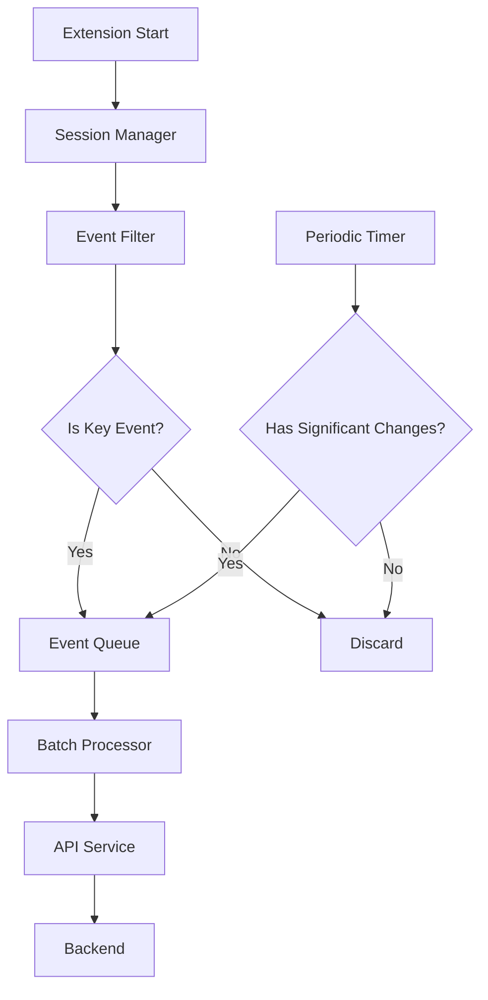

# Design Document

## Overview

This design optimizes the session reporting system in the TikTok Repost Remover extension by implementing a selective event reporting strategy. Instead of reporting every minor state change and progress update, the system will focus on key lifecycle events and meaningful metrics that provide business value while dramatically reducing API overhead.

## Architecture

### Current State Analysis

The current implementation has several inefficiencies:
- **Excessive API calls**: Every video processing event triggers an API call
- **High-frequency updates**: Session updates every 10 seconds during processing
- **Redundant data**: Multiple similar messages sent within short time windows
- **Verbose logging**: Individual video removals and skips are all reported
- **Duplicate prevention gaps**: Message deduplication exists but isn't comprehensive

### Proposed Architecture



## Components and Interfaces

### 1. Event Classification System

**Key Events (Report Always):**
- Session creation/initialization
- Login status changes (logged in/out)
- Process start (with total reposts found)
- Process completion (with final metrics)
- Process pause/resume
- Critical errors
- User abandonment

**Non-Key Events (Filter Out):**
- Individual video processing
- Real-time progress updates
- Waiting/countdown states
- Temporary status messages
- Duplicate state changes

### 2. Session Manager Enhancement

```javascript
class OptimizedSessionManager {
  constructor() {
    this.keyEventQueue = [];
    this.lastSignificantUpdate = null;
    this.batchTimer = null;
    this.UPDATE_THRESHOLD = 30000; // 30 seconds minimum between updates
  }
  
  // Only queue key events
  reportKeyEvent(eventType, data) {
    if (this.isKeyEvent(eventType)) {
      this.keyEventQueue.push({
        type: eventType,
        data: data,
        timestamp: Date.now()
      });
      this.processBatch();
    }
  }
  
  // Batch processing to reduce API calls
  processBatch() {
    if (this.batchTimer) return;
    
    this.batchTimer = setTimeout(() => {
      this.flushEventQueue();
      this.batchTimer = null;
    }, 1000); // 1 second batching window
  }
}
```

### 3. Event Filter Interface

```javascript
class EventFilter {
  static isKeyEvent(eventType, data) {
    const keyEvents = [
      'session_created',
      'login_status_changed',
      'process_started',
      'process_completed',
      'process_paused',
      'process_resumed',
      'critical_error',
      'user_abandoned'
    ];
    
    return keyEvents.includes(eventType);
  }
  
  static hasSignificantChange(currentState, lastState) {
    // Only report if meaningful metrics changed
    const significantFields = [
      'total_reposts_found',
      'process_status',
      'login_status',
      'error_count'
    ];
    
    return significantFields.some(field => 
      currentState[field] !== lastState[field]
    );
  }
}
```

### 4. Optimized API Service

```javascript
class OptimizedApiService extends ApiService {
  constructor() {
    super();
    this.pendingUpdates = new Map();
    this.lastUpdateTime = 0;
    this.MIN_UPDATE_INTERVAL = 30000; // 30 seconds
  }
  
  async updateSessionOptimized(sessionId, updateData) {
    const now = Date.now();
    
    // Throttle updates
    if (now - this.lastUpdateTime < this.MIN_UPDATE_INTERVAL) {
      // Queue the update instead of sending immediately
      this.pendingUpdates.set(sessionId, {
        ...this.pendingUpdates.get(sessionId),
        ...updateData,
        timestamp: now
      });
      return;
    }
    
    // Include any pending updates
    const finalData = {
      ...this.pendingUpdates.get(sessionId),
      ...updateData
    };
    
    this.pendingUpdates.delete(sessionId);
    this.lastUpdateTime = now;
    
    return this.updateSession(sessionId, finalData);
  }
}
```

## Data Models

### Optimized Session Event Model

```javascript
const SessionEvent = {
  session_id: String,
  event_type: String, // 'created', 'started', 'completed', 'error', etc.
  timestamp: Number,
  data: {
    // Key metrics only
    total_reposts_found: Number,
    reposts_removed: Number,
    reposts_skipped: Number,
    process_duration: Number,
    error_type: String,
    login_status: String,
    tiktok_username: String
  }
};
```

### Consolidated Session Summary

```javascript
const SessionSummary = {
  session_id: String,
  start_time: Number,
  end_time: Number,
  total_duration: Number,
  login_status: String,
  tiktok_username: String,
  process_status: String, // 'completed', 'abandoned', 'error'
  metrics: {
    total_reposts_found: Number,
    reposts_removed: Number,
    reposts_skipped: Number,
    success_rate: Number,
    pause_count: Number,
    error_count: Number
  }
};
```

## Error Handling

### API Failure Resilience

1. **Graceful Degradation**: Extension continues functioning even if API calls fail
2. **Retry Logic**: Key events are retried with exponential backoff
3. **Local Caching**: Session data cached locally as backup
4. **Error Aggregation**: Multiple errors batched into single report

### Duplicate Prevention

1. **Message Deduplication**: Enhanced duplicate detection across all event types
2. **State Comparison**: Only report when state actually changes
3. **Time-based Throttling**: Minimum intervals between similar events

## Testing Strategy

### Unit Tests

1. **Event Classification**: Test key vs non-key event identification
2. **Batch Processing**: Verify events are properly queued and batched
3. **Throttling Logic**: Ensure API calls are properly throttled
4. **Duplicate Detection**: Test duplicate message prevention

### Integration Tests

1. **End-to-End Flow**: Test complete session lifecycle with optimized reporting
2. **API Load Testing**: Verify reduced API call volume
3. **Error Scenarios**: Test behavior when API calls fail
4. **Performance Testing**: Measure impact on extension performance

### Performance Metrics

**Before Optimization:**
- ~50-100 API calls per session
- Updates every 10 seconds during processing
- Individual video events reported

**After Optimization Target:**
- ~5-15 API calls per session (70%+ reduction)
- Updates maximum every 30 seconds
- Only key lifecycle events reported

## Implementation Phases

### Phase 1: Event Classification
- Implement event filtering system
- Update existing code to use event classification

### Phase 2: Batch Processing
- Add event queuing and batching
- Implement throttling mechanisms

### Phase 3: API Optimization
- Update API service with optimized methods
- Add duplicate prevention enhancements

### Phase 4: Testing & Validation
- Comprehensive testing of optimized system
- Performance measurement and validation